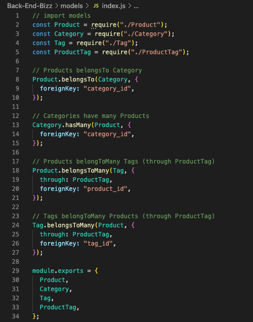

# Back-End-Bizz
I created the back end for an e-commerce site by modifying starter code provided by the University of Washington's Fullstack Coding Bootcamp. I set up an Express.js API that uses Sequelize to interact with a MySQL database.

## Description
As a manager of an internet retail company, I will be able to use this back end for my e-commerce website, which will compete with other growing brands by utilizing cutting-edge technologies to showcase products that I am selling.
                                                 
## Walkthrough Tutorial of Application
 

## Screenshot of Code/Live Application

## Table of Contents
* [Installation](#installation)
* [Dependencies](#dependencies)
* [Usage](#usage)
* [Contributors](#contributors)
* [Testing](#testing)
* [Questions](#questions)

## Installation
To get started, clone this repository on Github and open it in your preferred IDE. To begin, type node server.js into the terminal. Finally, using the Insomnia Application, test each route.

## Dependencies 
Insomnia, Node.js, MySQL/MySQL2, Express.js, Sequelize

## Usage
Enter npm start in your IDE terminal. This will launch the service, and you can search through the material by typing "localhost:3001/api" into insomnia. Start mysql by running /usr/local/mysql/bin/mysql -u root -p in your terminal, followed by sourcing the database: source db/schema.sql. 

## Contributors 
N/A, Marley Schneider

## License

This project is licensed under the [MIT](https://opensource.org/license/mit/) license. 

## Testing
No testing instructions applicable for this application.

## Questions
If you have questions, please send them [here](mailto:marleysue@gmail.com?subject=[GitHub]%20Dev%20Connect) or visit [github/marleyschneiderr](https://github.com/marleyschneiderr).